***System Analysis and Design Project - Arsalan Jabbari***

***Online Shop Development System***

***Fall-2023\_Winter-2024***

**Outline**

- [***About Our Project***](#_page0_x72.00_y347.28)
- [***Phase 1 - DFD Level 0 & 1***](#_page5_x72.00_y593.02)
- [***Phase 2 - Vision and Use-Case***](#_page7_x72.00_y373.22)
- [***Phase 3 - Domain Model and SSD***](#_page16_x72.00_y438.24)
- [***Phase 4 - Operation Contract***](#_page30_x72.00_y600.67)
- [***Phase 5 - Method Retrivation and Class Diagram***](#_page38_x72.00_y592.29)
- [***Phase 6 - Sequence Diagram and Communication Diagram***](#_page40_x72.00_y418.68)
- [***Glossary***](#_page62_x72.00_y656.10)

**About Our Project**

- **Name**

   - ***ClickCart Company***

- **Requirements**

   **Functional Requirements**

      1. User Authentication and Authorization:
         a. Differentiate access levels for Customer, Admin, and Super-Admin.
         b. Authenticate and authorize users based on roles and permissions.
  
      2. Customer Management:
         a. Registration and login functionality for Customers.
         b. Allow customers to view and edit their profiles.
  
      3. Product Management:
         a. Add, edit, delete products from the Products-Info database.
         b. Assign products to relevant categories.
  
      4. Order Processing:
         a. Enable Customers to place orders.
         b. Allow Customers to view order history and status.
         c. Admins should be able to manage and update order statuses.
  
      5. Admin and Super-Admin Controls:
         a. Admins manage product listings, categories, and customer orders.
         b. Super-Admin oversees the system, managing admins and system settings.
  
      6. Category Management:
         a. Ability to create, update, and delete product categories in the Categories-Info database.
  
      7. Comments and Feedback:
         a. Allow Customers to leave comments and feedback on products.
         b. Admins should be able to moderate and manage comments.
  
      8. Payment and Delivery Integration:
         a. Integration with Payment-System for secure payment processing.
         b. Integration with Delivery-System for order shipment and tracking.
  
      9. Inventory Management:
         a. Connect Products-Info with Inventory-System to manage stock levels and availability.

   **Non-Functional Requirement**

      1. Security:
         a. Implement secure encryption methods for user data and transactions.
         b. Regular data backups to prevent data loss.
  
      2. Scalability and Performance:
         a. Ensure the system can handle increasing numbers of users and transactions.
         b. Optimize system performance to provide a seamless shopping experience.
  
      3. User Interface and Experience:
         a. Design an intuitive and user-friendly interface for easy navigation.
         b. Ensure compatibility across various devices and browsers.
  
      4. Reliability:
         a. Minimize system downtime and ensure high availability.
  
      5. Compliance:
         a. Ensure compliance with relevant data protection and privacy regulations.
      
      These requirements should serve as a foundation for the development of your online shop system, focusing on the functionalities needed to manage data, users, and external systems effectively while delivering a seamless shopping experience for customers. Tailor and expand upon these requirements based on your specific project needs and goals.

- **Capabilities**
  
      1. User Management:
         a. Registration and login for Customers, Admins, and Super-Admins.
         b. Password management and security features like password reset and account recovery.
      
      2. Role-Based Access Control:
         a. Differentiate between Customer, Admin, and Super-Admin roles with varying access levels and permissions.
         b. Super-Admin privileges for system-wide management and oversight.
      
      3. Product Catalog Management:
         a. Ability to add, edit, and delete products from the Products-Info database.
         b. Categorize products into distinct categories from Categories-Info.
      
      4. Order Processing Capabilities:
         a. Allow Customers to add items to their carts, place orders, and proceed to checkout.
         b. Enable Admins to manage and update order statuses, view order details, and track deliveries.
      
      5. Comment and Feedback Management:
         a. Enable Customers to leave comments and ratings on products.
         b. Admins can moderate, respond to, or remove comments as needed.
      
      6. Integration Capabilities:
         a. Seamless integration with external systems such as Payment-System, Delivery-System, and Inventory-System.
         b. Real-time synchronization of inventory levels with the Inventory-System.
      
      7. Reporting and Analytics:
         a. Generate reports on sales, customer behavior, popular products, and inventory levels for Admins and Super-Admins.
         b. Provide insights and analytics to aid in decision-making and business growth strategies.
      
      8. Payment and Checkout Capabilities:
         a. Secure payment processing through Payment-System integration.
         b. Multiple payment options (credit/debit cards, digital wallets, etc.) for Customers.
      
      9. Inventory Management:
         a. Track and manage product inventory levels, update stock availability, and notify when items are out of stock.
      
      10.Security and Compliance:
         a. Implement encryption measures to protect user data and transactions.
         b. Ensure compliance with relevant data protection regulations (GDPR, etc.).
      
      11.Scalability and Performance:
         a. Ability to handle increasing user traffic and transaction volumes without compromising system performance.

- **Applicabilities**
     
      1. E-commerce Operations:
         a. The system is applicable for businesses aiming to establish an online presence and conduct e-commerce operations.
         b. Suitable for retail businesses looking to sell products online to a wide customer base.
  
      2. Multiple User Roles and Access Levels:
         a. Applicable for systems requiring distinct user roles like Customers, Admins, and Super-Admins, each with specific access levels and permissions.
         b. Ideal for platforms necessitating controlled access to different functionalities based on user roles.
  
      3. Product-Centric Businesses:
         a. Suitable for businesses heavily reliant on product catalog management, allowing easy addition, editing, and categorization of products.
         b. Applicable for businesses dealing with various product categories and inventory management needs.
  
      4. Order Processing and Fulfillment:
         a. Applicable for businesses requiring a streamlined order processing system, enabling Customers to place orders and Admins to manage and fulfill them.
         b. Ideal for businesses seeking efficient order tracking and status updates.
  
      5. Interfacing with External Systems:
         a. Suitable for businesses needing integration with external systems such as Payment-System, Delivery-System, and Inventory-System.
         b. Applicable for platforms aiming to synchronize inventory levels, manage payments securely, and facilitate order deliveries.
  
      6. Feedback and Review Management:
         a. Relevant for businesses wanting to collect and manage customer feedback, ratings, and comments on products.
         b. Ideal for platforms aiming to engage customers through reviews and interactions.
  
      7. Compliance and Security Requirements:
         a. Applicable for businesses requiring adherence to data protection regulations and implementing secure measures for user data and transactions.
         b. Suitable for platforms prioritizing user privacy and data security.
  
      8. Scalability and Performance Demands:
         a. Suitable for businesses anticipating growth and requiring a scalable system capable of handling increasing user traffic and transaction volumes.
         b. Ideal for platforms seeking high performance and reliability even during peak usage periods.

**Phase 1 - DFD Level 0 & 1**

***DFD Level 0***

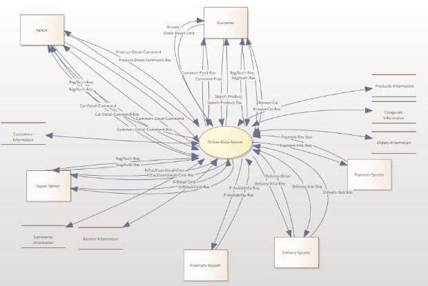

***DFD Level 1***

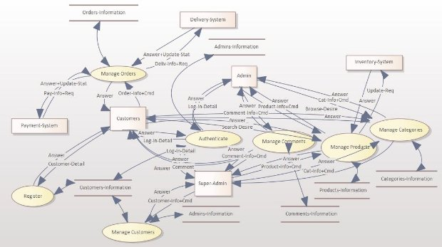

**Phase 2 - Vision and Use-Case**

- **Vision**
  - ***Problem Statement***

    The absence of a comprehensive, user-centric online shopping platform bothers customers' access to a seamless shopping experience and helps businesses from efficiently managing their e-commerce operations.

- ***Stakeholder Description***

   - **Primary Stakeholders**
      1. Business Owners/Entrepreneurs
      2. Operations Managers
      3. Marketing and Sales Teams
      4. Customers

   - **Secondary Stakeholders**
      1. IT Support Team
      2. External Suppliers and Vendors
      3. Payment Gateway Providers
         
- ***Key High-Level Goals***
   - Enhanced User Experience: Develop an intuitive interface for Customers and streamlined management tools for Admins and Super-Admins.
   - Scalable and Secure Platform: Ensure scalability to accommodate increased user traffic and implement robust security measures to protect user data.
   - Seamless Integration: Establish seamless integration with external systems (Payment, Delivery, and Inventory) for efficient operations.
   - Comprehensive Functionality: Provide comprehensive functionalities for product management, order processing, feedback management, and reporting.
   - Performance and Reliability: Optimize performance for responsiveness and reliability, minimizing system downtime and ensuring high availability.

- ***Functional Features***
   - User authentication and role-based access control.
   - Product catalog management with category organization.
   - Order placement, tracking, and status updates for Customers and Admins.
   - Comments and feedback management for product reviews.
   - Integration with external systems: Payment, Delivery, and Inventory.
     
- ***Non-functional Features***
   - Scalability and Performance:
      - Fast Response Times: Ensures swift loading and processing of pages and transactions, reducing user wait times.
      - Scalability: Capable of handling increased user traffic and transaction volumes without compromising performance.
      - Resource Optimization: Efficiently utilizes system resources to maintain optimal performance even during peak loads.
   - Security and Compliance:
      - Access Control: Implements robust role-based access controls, ensuring appropriate permissions and limiting unauthorized access.
      - Data Protection: Utilizes encryption and secure data storage methods to safeguard sensitive information, preventing breaches or unauthorized access.
      - Regular Security Checks: Conducts routine security checks and updates to ensure ongoing protection.
   - Reliability:
      - High Uptime: Operates consistently with minimal downtime, ensuring the system is available for users' needs.
      - Backup and Recovery: Regularly backs up data and maintains mechanisms for swift recovery in case of unforeseen system failures or data loss.
   - Usability and User Experience:
      - User-Friendly Interface: Offers an intuitive and easily navigable interface for users, enhancing their experience while interacting with the platform.
      - Mobile Compatibility: Ensures the platform's functionality and responsiveness on various devices, including smartphones, enabling seamless access and use across different screens.
    
      
- **Use-Cases Scenario**
  
      1. Authentication
         a. User chooses “Log-In” between “Log-In” and “Register” in the first page.
         b. User enters their username, password, and selects their role in the multiple choice (Customer, Admin, Super-Admin).
         c. System checks if entered information exists in users’ information based on the entered role.
         d. System displays a success message.
         e. System leads the user to their first page (based on their role).
      - Alternative Flow
         b.1. User’s username or password is wrong.
         b.1.1. The system asks the user to enter their information again or go to the registration page.
      
      2. Customer Registration
         a. User chooses “Register” between “Log-In” and “Register” in the first page.
         b. User enters their username, password, fullname, e-mail, phone, address, zip-code.
         c. System sends a verification e-mail to their entered e-mail.
         d. System verifies the customer after receiving the verification.
         e. System creates a cart for new customer and assign it to them.
         f. System leads the user to the customer's first page.
      - Alternative Flow
         b.1. They enters a reserved username as their username.
         b.1.1. System asks the customer to change their username.
         b.2. They enters a reserved e-mail address as their e-mail.
         b.2.1. System asks the customer to change their e-mail.
         b.3. The customer doesn't fill all the fields and submit the form.
         b.3.1. System asks the customer to fill all fields.
         d.1. System doesn’t get verification from the customer's email after 2 minutes.
         d.1.1. System tells the customer that you don’t verified and fill the form again.
      
      3. Search Product
         a. Customer search for their desired product.
         b. System finds and displays the entered product.
      - Alternative Flow
         b.1. System doesn’t find the product.
         b.1.1. System displays the-not-found-message.
      
      4. Browse Category
         a. Customer selects their desired category.
         b. System displays the selected category.
  
      5. Write Comment
         a. Customer comments for displayed product and submits.
      
      6. Add Product to Cart
         a. Customer adds the displayed product to his cart.
      - Alternative Flow   
         a.1. Selected product is not available.
         a.1.1. System doesn’t add it to cart and show appropriate message.
      
      7. Check Cart
         a. Customer request leading to the pending cart’s page.
         
      8. Change Amount in Cart
         a. Customer changes the amount of selected products incrementally or decrementally in the cart's page.
      - Alternative Flow
         a.1. Unavailability of a product after incrementing its amount.
      
      9. Delete Cart (Cancel Cart)
         a. Customer decides to cancel their purchase/delete the pending cart.
         b. System deletes the customer’s cart’s content.
     
      10. Pay Cart (Finalize Cart)
         a. Customer decides to pay their pending cart/finalize their cart.
         b. System calculates the overall cost and displays it and asks the customer to confirm the bill.
         c. System leads the customer to the Payment-System.
         d. System gets success from the payment system.
         e. System registers the related order and cleans the customer’s cart.
         f. System asks the delivery system for a paid order and displays its details.
      - Alternative Flow
         a.1. The cart is empty.
         a.1.1. System displays appropriate messages.   
         b.1. Customer doesn’t confirm the bill.   
         c.1.1. System redirects the customer to the cart page. d.1. The payment was not successful.   
         e.1.1. System displays appropriate message.
      
      11. Update Delivery Status
         a. System asks the delivery system to update orders’ delivery status and informs the system every six hours.
         b. System updates delivery statuses in orders of system based on delivery system reports.
  
      12. Add Product
         a. User (Admin or Super-Admin) enters a new product detail to define it in the system.
         b. System registers the new product and displays the appropriate message.
      - Alternative Flow
         b.1. System finds the entered details of the product not unique.
         b.1.1. Displays appropriate error message and let user try again.
      
      13. Edit Product
         a. User (Admin or Super-Admin) enters a product’s details to find it in the system.
         b. User (Admin or Super-Admin) enters the product’s new details to save its new version in the system.
         c. System registers the new version of the product and displays the appropriate message.
      - Alternative Flow
         b.1. System finds the entered details of the product not unique.   
         b.1.1. Displays appropriate error message and let user try again.
      
      14. Delete Product
         a. User (Admin or Super-Admin) enters a product’s details to delete it in the system.
         b. System deletes the product and displays the appropriate message.
      - Alternative Flow
         b.1. System doesn’t find the entered details of the product.   
         b.1.1. Displays appropriate error message and let user try again.
      
      15. Add Category
         a. User (Admin or Super-Admin) enters a new category detail to define it in the system.
         b. System registers the new category and displays the appropriate message.
      - Alternative Flow      
         b.1. System finds the entered details of the category not unique.   
         b.1.1. Displays appropriate error message and let user try again.
      
      16. Edit Category
         a. User (Admin or Super-Admin) enters a category’s details to find it in the system.
         b. User (Admin or Super-Admin) enters the category’s new details to save its new version in the system.
         c. System registers the new version of the product and displays the appropriate message.
      - Alternative Flow
         b.1. System finds the entered details of the product not unique.  
         b.1.1. Displays appropriate error message and let user try again.
      
      17. Delete Category
         a. User (Admin or Super-Admin) enters a category’s details to delete it in the system.
         b. System deletes the category and displays the appropriate message.
      - Alternative Flow
         b.1. System doesn’t find the entered details of the category.
         b.1.1. Displays appropriate error message and let user try again.
      
      18. Reply Comment
         a. User (Admin or Super-Admin) enters a comment’s details to reply.
         b. User (Admin or Super-Admin) write the reply comment.
         c. System inserts the reply comment and displays the appropriate message.
      - Alternative Flow
         c.1. System doesn’t find the entered details of the comment.   
         c.1.1. Displays appropriate error message and let user try again.
      
      19. Delete Comment
         a. User (Admin or Super-Admin) enters a comment’s details to delete it in the system.
         b. System deletes the comment and displays the appropriate message.
      - Alternative Flow
         b.1. System doesn’t find the entered details of the comment.
         b.1.1. Displays appropriate error message and let user try again.
      
      20. Add Customer
         a. User (Super-Admin) enters a new customer detail to define it in the system.
         b. System registers the new customer and displays the appropriate message.
      - Alternative Flow
         b.1. System finds the entered details of the customer not unique.   
         b.1.1. Displays appropriate error message and let user try again.
      
      21. Edit Customer
         a. User (Super-Admin) enters a customer’s details to find it in the system.
         b. User (Super-Admin) enters the customer’s new details to save its new version in the system.
         c. System registers the new version of the customer and displays the appropriate message.
      - Alternative Flow
         b.1. System finds the entered details of the customer not unique.   
         b.1.1. Displays appropriate error message and let user try again.
     
      22. Delete Customer
         a. User (Super-Admin) enters a customer’s details to delete it in the system.
         b. System deletes the customer and displays the appropriate message.
      - Alternative Flow
         b.1. System doesn’t find the entered details of the customer.
         b.1.1. Displays appropriate error message and let user try again.
      
      23. Manage Admin
         a. User (Super-Admin) enters a customer’s details to promote it or enters an admin’s details to demote it in the system.
         b. System changes the customer or admin’s role and displays the appropriate message.
      - Alternative Flow
         b.1. System doesn’t find the entered details.
         b.1.1. Displays appropriate error message and let user try again.
      
      24. Update Availability
         a. System asks the inventory system to update products’ availability and informs the system every six hours.
         b. System updates availability in products of the system based on inventory system reports.
  
**Phase 3 - Domain Model and SSD**

**Domain Model**

   (Done after 4 iterations.)
   
   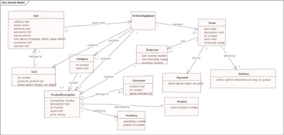

**SSD**

1. ***Authentication***

   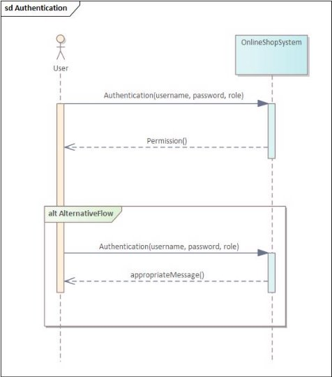

3. ***Customer Registration***

   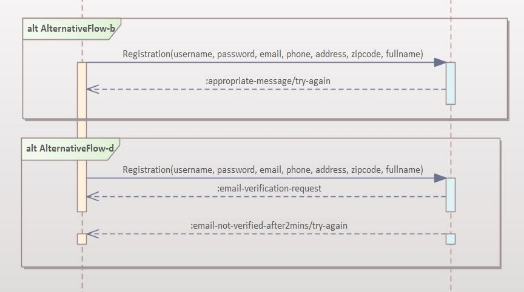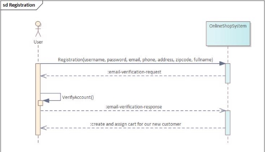

5. ***Search Product***

   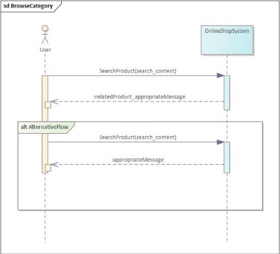

7. ***Browse Category***

   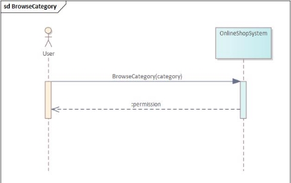

5. ***Write Comment***

   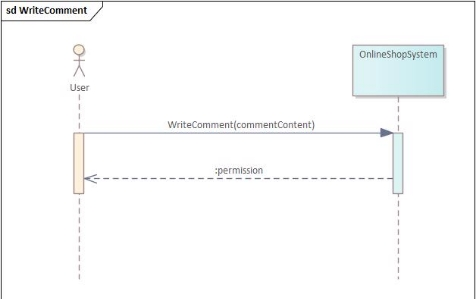

6. ***Add Product to Cart***

   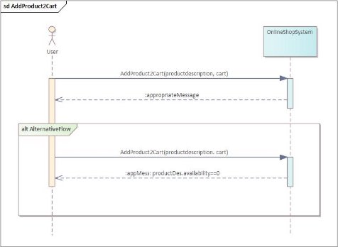

7. ***Check Cart***

   

8. ***Change Amount in Cart***

   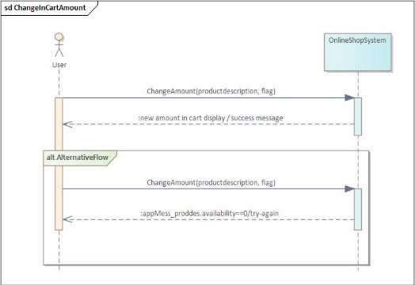

9. ***Delete Cart (Cancel Cart)***

   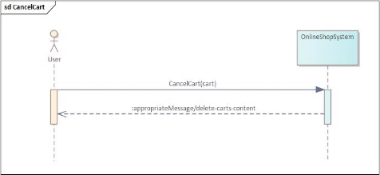

10. ***Pay Cart (Finalize Cart)***

   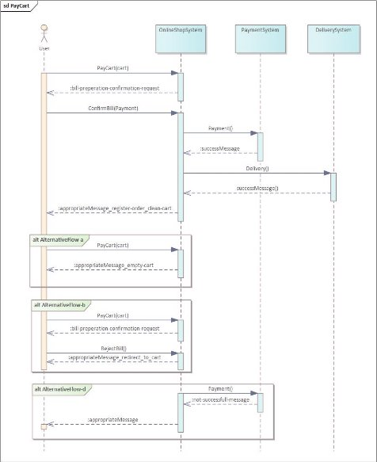

11. ***Update Delivery Status***

   

12. ***Add Product***

   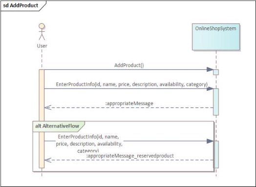

13. ***Edit Product***

   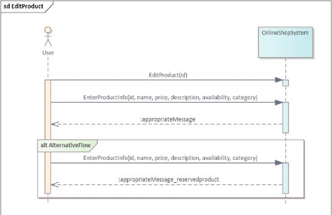

14. ***Delete Product***

   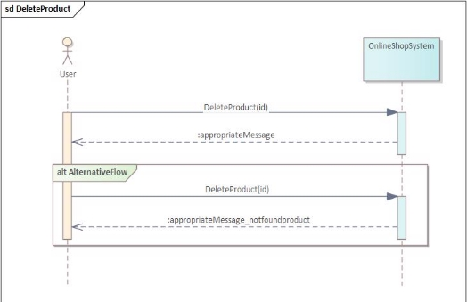

15. ***Add Category***

   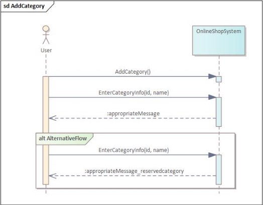

16. ***Edit Category***

   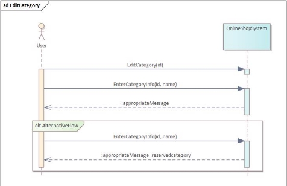

17. ***Delete Category***

   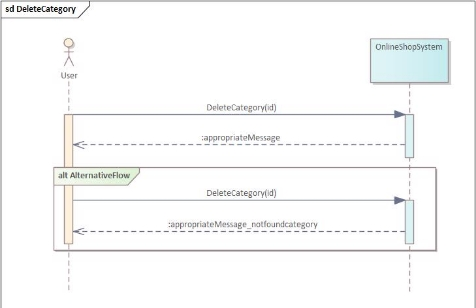

18. ***Reply Comment***

   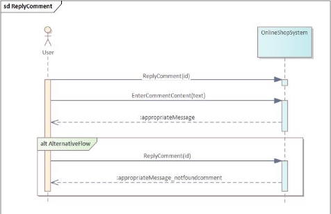

19. ***Delete Comment***

   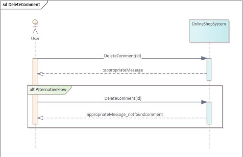

20. ***Add Customer***

   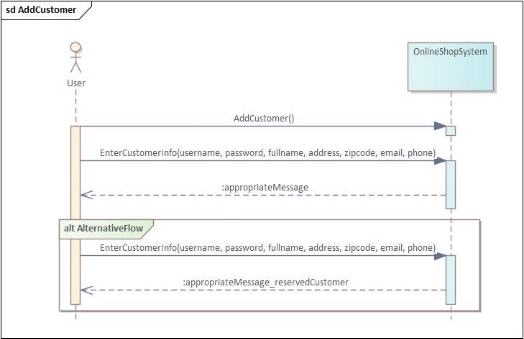

21. ***Edit Customer***

   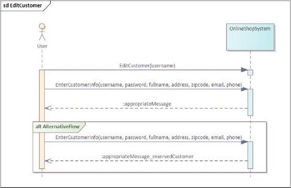

22. ***Delete Customer***

   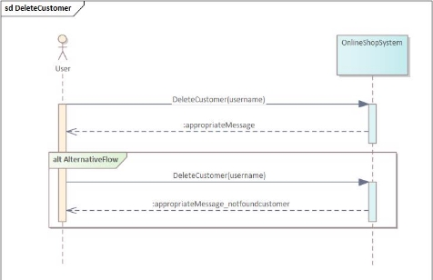

23. ***Manage Admin***

   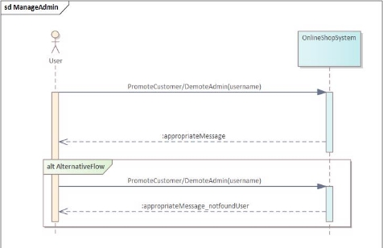

24. ***Update Availability***

   

**Phase 4 - Operation Contract**

1. **Authentication**

   - ***Pre-Condition***
      - *U of User, S of System*

   - ***Post-Condition***
      1. *New-Object: X*
      2. *Delete-Object: X*
      3. *New-Association: User U with System S*
      4. *Delete-Association: X*
      5. *Change-Attribute: X*
         
   - ***Sub-Responsibility***
      - *Checking entered username, password and role.*

2. **Customer Registration**

   - ***Pre-Condition***
      - *System S*

   - ***Post-Condition***
      1. *New-Object: U of User, CT of Cart*
      2. *Delete-Object: X*
      3. *New-Association: User U with System S, Cart CT with User U*
      4. *Delete-Association: X*
      5. *Change-Attribute: X*

   - ***Sub-Responsibility***
      - *Email verification.*
      - *Save new user’s data in role-related stores.*

3. **Search Product**

   - ***Pre-Condition***
      - *ProductDescription PD*

   - ***Post-Condition***
      1. *New-Object: X*
      2. *Delete-Object: X*
      3. *New-Association: X*
      4. *Delete-Association: X*
      5. *Change-Attribute: X*

   - ***Sub-Responsibility***
      - *Retrieve similar product description with searched token.*

4. **Browse Category**

   - ***Pre-Condition***
      - *Category C*

   - ***Post-Condition***
      1. *New-Object: X*
      2. *Delete-Object: X*
      3. *New-Association: X*
      4. *Delete-Association: X*
      5. *Change-Attribute: X*

   - ***Sub-Responsibility***
      - *Nothing*

5. **Write Comment**

   - ***Pre-Condition***
      - *ProductDescription PD, User U*

   - ***Post-Condition***
      1. *New-Object: Comment CM*
      2. *Delete-Object: X*
      3. *New-Association: Comment CM with ProductDescription PD, Comment CM with User U*
      4. *Delete-Association: X*
      5. *Change-Attribute: New comment attributes*

   - ***Sub-Responsibility***
      - *Nothing*

6. **Add Product to Cart**

   - ***Pre-Condition***
      - *Cart CT, Product P*

   - ***Post-Condition***
      1. *New-Object: X*
      2. *Delete-Object: X*
      3. *New-Association: Product P with Cart CT*
      4. *Delete-Association: X*
      5. *Change-Attribute: X*

   - ***Sub-Responsibility***
      - *Nothing*
        
7. **Check Cart**

   - ***Pre-Condition***
      - *Cart CT*

   - ***Post-Condition***
      1. *New-Object: X*
      2. *Delete-Object: X*
      3. *New-Association: X*
      4. *Delete-Association: X*
      5. *Change-Attribute: X*

   - ***Sub-Responsibility***
      - *Calculate and report total price.*
      - *Ask users to choose between pay and cancel.*

8. **Change Amount in Cart**

   - ***Pre-Condition***
      - *Cart CT, Product P*

   - ***Post-Condition***
      1. *New-Object: X*
      2. *Delete-Object: X*
      3. *New-Association: Product P and Cart CT*
      4. *Delete-Association: Product P and Cart CT*
      5. *Change-Attribute: Price, Products*

   - ***Sub-Responsibility***
      - *Recalculating the price and amount of each product in the cart.*

9. **Delete Cart (Cancel Cart)**

   - ***Pre-Condition***
      - *Cart CT*

   - ***Post-Condition***
      1. *New-Object: X*
      2. *Delete-Object: X*
      3. *New-Association: X*
      4. *Delete-Association: Product P and Cart CT*
      5. *Change-Attribute: X*

   - ***Sub-Responsibility***
      - *Nothing*

10. **Pay Cart (Finalize Cart)**

   - ***Pre-Condition***
      - *Cart CT, User U, System S*

   - ***Post-Condition***
      1. *New-Object: PY of Payment, O of Order, D of Delivery*
      2. *Delete-Object: X*
      3. *New-Association: Order O with User U and Order O with Payment PY and with Delivery D*
      4. *Delete-Association: Product P with Cart CT*
      5. *Change-Attribute: Pay-Status to Paid everywhere, Delivery-Status initialize everywhere*

   - ***Sub-Responsibility***
      - *Calculate and pass the total price to the payment system.*
      - *Pass details to the delivery system.*

11. **Update Delivery Status**

   - ***Pre-Condition***
      - *System S, Delivery D, Order O*

   - ***Post-Condition***
      1. *New-Object: X*
      2. *Delete-Object: X*
      3. *New-Association: X*
      4. *Delete-Association: X*
      5. *Change-Attribute: Update Delivery Status*

   - ***Sub-Responsibility***
      - *Update new delivery statuses in the order datastore.*

12. **Add Product**

   - ***Pre-Condition***
      - *System S, User U*

   - ***Post-Condition***
      1. *New-Object: ProductDescription PD*
      2. *Delete-Object: X*
      3. *New-Association: ProductDescription PD with System S*
      4. *Delete-Association: X*
      5. *Change-Attribute: ProductDescription attributes*

   - ***Sub-Responsibility***
      - *Nothing*

13. **Edit Product**

   - ***Pre-Condition***
      - *User U, ProductDescription PD, System S*

   - ***Post-Condition***
      1. *New-Object: X*
      2. *Delete-Object: X*
      3. *New-Association: X*
      4. *Delete-Association: X*
      5. *Change-Attribute: Edited atts. in ProductDescription*

   - ***Sub-Responsibility***
      - *Nothing*

14. **Delete Product**

   - ***Pre-Condition***
      - *User U, ProductDescription PD, System S*

   - ***Post-Condition***
      1. *New-Object: X*
      2. *Delete-Object: PD of ProductDescription*
      3. *New-Association: X*
      4. *Delete-Association: X*
      5. *Change-Attribute: X*

   - ***Sub-Responsibility***
      - *Nothing*

15. **Add Category**

   - ***Pre-Condition***
      - *System S, User U*

   - ***Post-Condition***
      1. *New-Object: Category CG*
      2. *Delete-Object: X*
      3. *New-Association: Category CG with System S*
      4. *Delete-Association: X*
      5. *Change-Attribute: Category attributes*

   - ***Sub-Responsibility***
      - *Nothing*

16. **Edit Category**

   - ***Pre-Condition***
      - *Category CG, User U*

   - ***Post-Condition***
      1. *New-Object: X*
      2. *Delete-Object: X*
      3. *New-Association: X*
      4. *Delete-Association: X*
      5. *Change-Attribute: Category edited attributes*

   - ***Sub-Responsibility***
      - *Nothing*

17. **Delete Category**

   - ***Pre-Condition***
      - *User U, Category CG*

   - ***Post-Condition***
      1. *New-Object: X*
      2. *Delete-Object: Category CG*
      3. *New-Association: X*
      4. *Delete-Association: X*
      5. *Change-Attribute: X*

   - ***Sub-Responsibility***
      - *Nothing*

18. **Reply Comment**

   - ***Pre-Condition***
      - *CM1 Comment*

   - ***Post-Condition***
      1. *New-Object: CM of Comment*
      2. *Delete-Object: X*
      3. *New-Association: CM of Comment and CM1 of Comment*
      4. *Delete-Association: X*
      5. *Change-Attribute: CM1 replies attribute appended*

   - ***Sub-Responsibility***
      - *Match entered comment id to reply.*

19. **Delete Comment**

   - ***Pre-Condition***
      - *CM Comment*

   - ***Post-Condition***
      1. *New-Object: X*
      2. *Delete-Object: CM of Comment*
      3. *New-Association: X*
      4. *Delete-Association: X*
      5. *Change-Attribute: X*

   - ***Sub-Responsibility***
      - *Nothing*

20. **Add Customer**

   - ***Pre-Condition***
      - *System S, User U*

   - ***Post-Condition***
      1. *New-Object: User C*
      2. *Delete-Object: X*
      3. *New-Association: User C with System S*
      4. *Delete-Association: X*
      5. *Change-Attribute: Customer attributes*

   - ***Sub-Responsibility***
      - *Nothing*

21. **Edit Customer**

   - ***Pre-Condition***
      - *User U, User C, System S*

   - ***Post-Condition***
      1. *New-Object: X*
      2. *Delete-Object: X*
      3. *New-Association: X*
      4. *Delete-Association: X*
      5. *Change-Attribute: Customer edited attributes*

   - ***Sub-Responsibility***
      - *Nothing*

22. **Delete Customer**

   - ***Pre-Condition***
      - *User U, User C, System S*

   - ***Post-Condition***
      1. *New-Object: X*
      2. *Delete-Object: User C*
      3. *New-Association: X*
      4. *Delete-Association: X*
      5. *Change-Attribute: X*

   - ***Sub-Responsibility***
      - *Nothing*

23. **Manage Admin**

   - ***Pre-Condition***
      - *SA User, C User/A User*

   - ***Post-Condition***
      1. *New-Object: X*
      2. *Delete-Object: X*
      3. *New-Association: X*
      4. *Delete-Association: X*
      5. *Change-Attribute: Role in User based on promotion/demotion.*

   - ***Sub-Responsibility***
      - *Control changes in user abilities.*

24. **Update Availability**

   - ***Pre-Condition***
      - *Product P*

   - ***Post-Condition***
      1. *New-Object: X*
      2. *Delete-Object: X*
      3. *New-Association: X*
      4. *Delete-Association: X*
      5. *Change-Attribute: Update Availability Status in products-relateds*

   - ***Sub-Responsibility***
      - *Update new availability statuses in the product datastore.*

**Phase 5 - Method Retrivation and Class Diagram**

- **Method Retrivation**
   - *Login(username, password, role)*
   - *Registration(username, password, fullname, email, phone, address, zipcode)*
   - *SendVerificationEmail(email)*
   - *CreateAssignCart(username)*
   - *SearchProduct(product\_name)*
   - *SelectProduct(product\_id)*
   - *BrowseCategory(category\_name)*
   - *SelectCategory(category\_id)*
   - *WriteComment(username, product\_id, comment\_text)*
   - *Add2Cart(cart\_id, product\_id)*
   - *CheckCart(cart\_id)*
   - *IncrementBuyAmount(cart\_id, product\_id)*
   - *DecrementBuyAmount(cart\_id, product\_id)*
   - *CancelCart(cart\_id)*
   - *ConfirmCart(cart\_id)*
   - *PaymentRequest(order\_id)*
   - *CalculatePrice(cart\_id)*
   - *ConfirmationRequest(cart\_id)*
   - *RegisterOrder(username, date, time, order\_id, total\_price, description, delivery\_st, pay\_st)*
   - *RegisterDelivery(order\_id)*
   - *ClearCart(cart\_id)*
   - *UpdateDeliveries()*
   - *UpdateAvailabilities()*
   - *ManageProduct(cmd)*
   - *AddProduct(id, name, price, description, availability, category)*
   - *EditProduct(id, name, price, description, availability, category)*
   - *DeleteProduct(id)*
   - *ManageCustomer(cmd)*
   - *AddCustomer(username, password, email, phone, address, fullname, zipcode)*
   - *EditCustomer(username, password, email, phone, address, fullname, zipcode)*
   - *DeleteCustomer(username)*
   - *ManageCategory(cmd)*
   - *AddCategory(id, name)*
   - *EditCategory(id, name)*
   - *DeleteCategory(id)*
   - *PromoteCustomer(username)*
   - *DemoteAdmin(username)*
   - *ReplyComment(alpha\_cm\_id, content)*
   - *DeleteComment(id)*

- **Class Diagram (Methods displayed without their parameters in case of abstraction)**

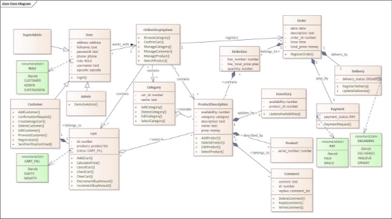

**Phase 6 - Sequence Diagram and Communication Diagram**

- **Sequence Diagram**

  There may be a longer way to reach the goal-use-case, but in this phase we are choosing the shortest path.

1. *Authentication*

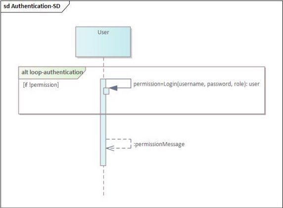

2. *Customer Registration*

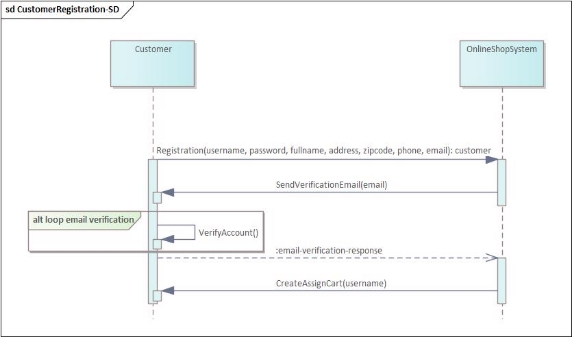

3. *Search Product*

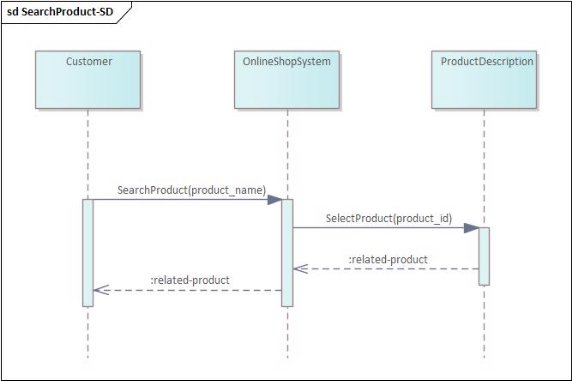

4. *Browse Category*

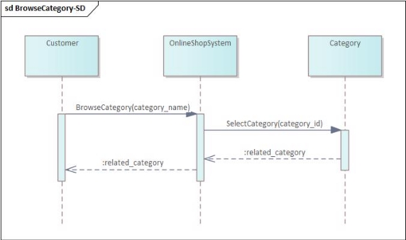

5. *Write Comment*

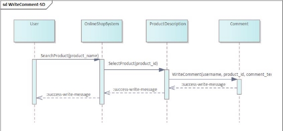

6. *Add Product to Cart*

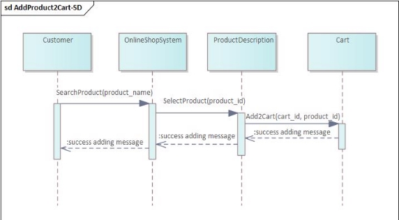

7. *Check Cart*

9. *Change Amount in Cart*

9. *Cancel Cart*

10. *Pay Cart*

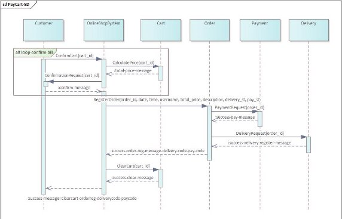

11. *Update Delivery Status*

12. *Add Product*

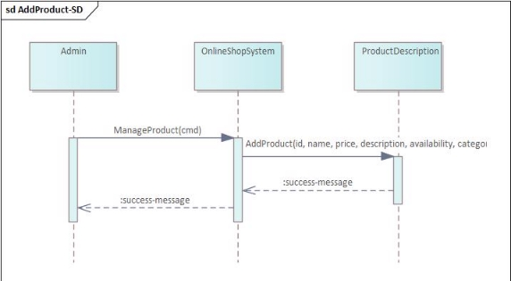

13. *Edit Product*

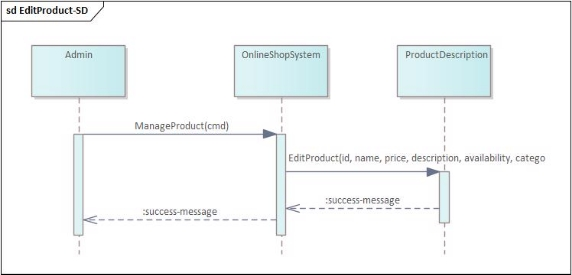

14. *Delete Product*

15. *Add Category*

16. *Edit Category*

17. *Delete Category*

18. *Reply Comment*

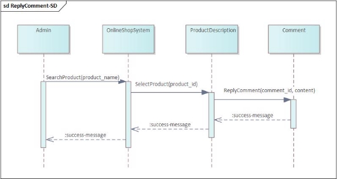

19. *Delete Comment*

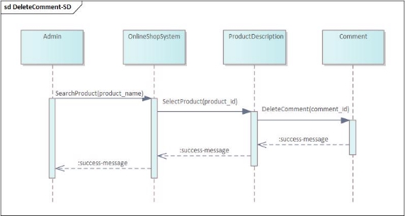

20. *Add Customer*

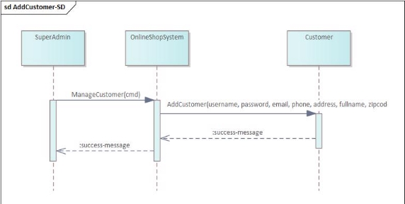

21. *Edit Customer*

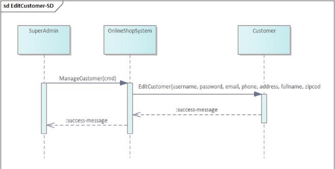

22. *Delete Customer*

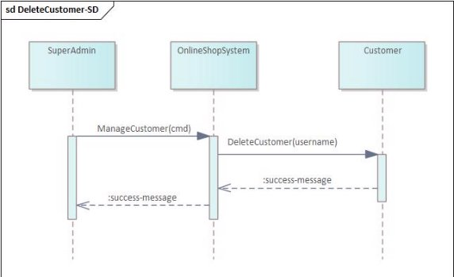

23. *Manage Admin*

24. *Update Availability*

- **Communication Diagram**
     
   - *Authentication*
   
   
   
   - *Customer Registration*
   
   
   
   - *Search Product*
   
   
   
   - *Browse Category*
   
   
   
   - *Write Comment*
   
   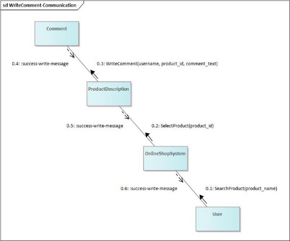
   
   - *Add Product to Cart*
   
   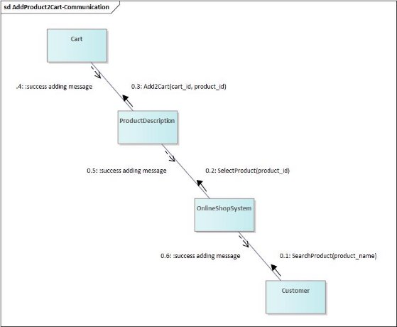
   
   - *Check Cart*
   
   
   
   - *Change Amount in Cart*
   
   
   
   - *Cancel Cart*
   
   
   
   - *Pay Cart*
   
   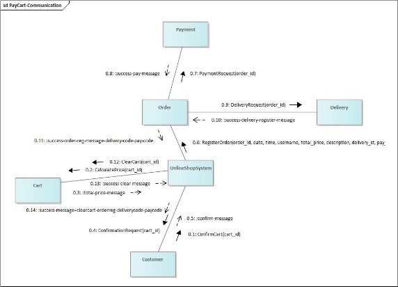
   
   - *Update Delivery Status*
   
   
   
   - *Add Product*
   
   
   
   - *Edit Product*
   
   
   
   - *Delete Product*
   
   
   
   - *Add Category*
   
   
   
   - *Edit Category*
   
   
   
   - *Delete Category*
   
   
   
   - *Reply Comment*
   
   
  
   - *Delete Comment*
   
   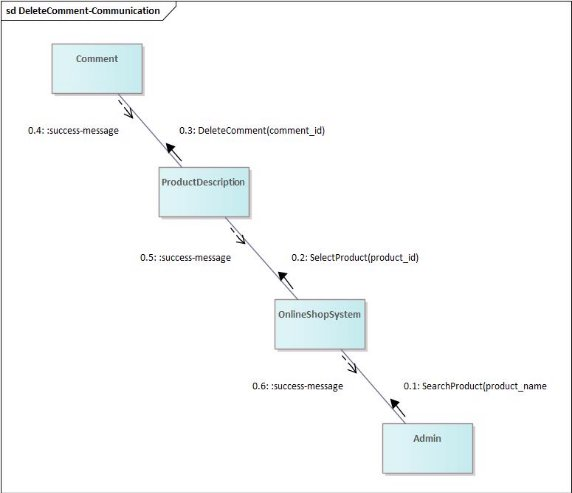
   
   - *Add Customer*
   
   
   
   - *Edit Customer*
   
   
   
   - *Delete Customer*
   
   
   
   - *Manage Admin*
   
   
   
   
   
   - *Update Availability*
   
   
   
   - *Startup Use Case Collaboration Diagram*
   
   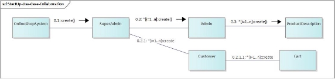

**Glossary**

***SuperAdmin:*** A privileged user with the highest level of access and authority within a system, often possessing rights to manage and oversee various administrative functions and settings.

***PromoteCustomer:*** The action of elevating a regular customer account to a higher level within the system, granting additional privileges or access rights typically associated with an administrative role.

***DemoteAdmin:*** The process of lowering the authority or privileges of an administrator, often reverting their account to a standard user or reducing their administrative access levels.

***CreateAssignCart:*** The functionality allows the system to generate and allocate a shopping cart to a specific user, enabling them to add items and manage their selections before checkout.

***CheckCart:*** The action of reviewing the contents of a shopping cart, including the items selected for purchase, quantities, and total costs.

***Add2Cart:*** The process of adding a selected item or product to the shopping cart within the online shopping system, allowing users to accumulate items for potential purchase.

***InventorySystem:*** A system designed to manage and track the availability, quantity, and status of products or goods within a store or business, ensuring accurate stock information.

***DeliverySystem:*** A logistical system or process responsible for managing and executing the delivery or shipping of ordered products to customers, including tracking and handling of shipments.

***OrderLine:*** A specific item or product line included within an order, detailing information such as product name, quantity, price, and any additional attributes related to the purchase.

***Product Serial-number:*** A unique identifier assigned to individual products, allowing for the differentiation and tracking of specific items within the inventory or sales system. Serial numbers are often used for product identification, warranties, and traceability.

[ref1]: Software-Project/Aspose.Words.1816cf2d-6f2b-477e-921d-0f4de917076c.002.png
